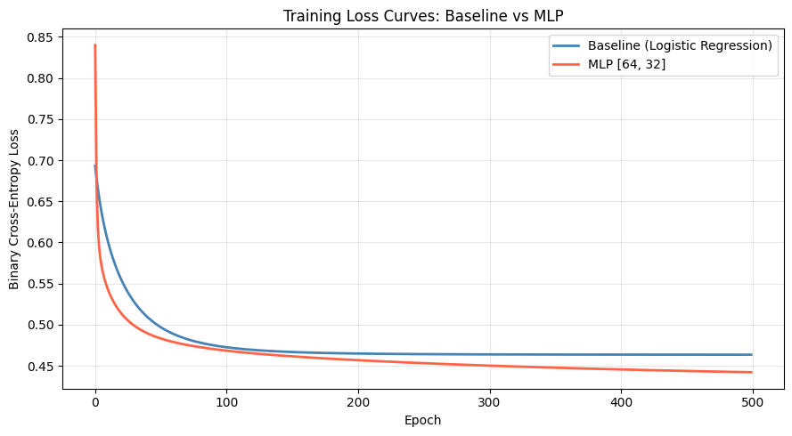
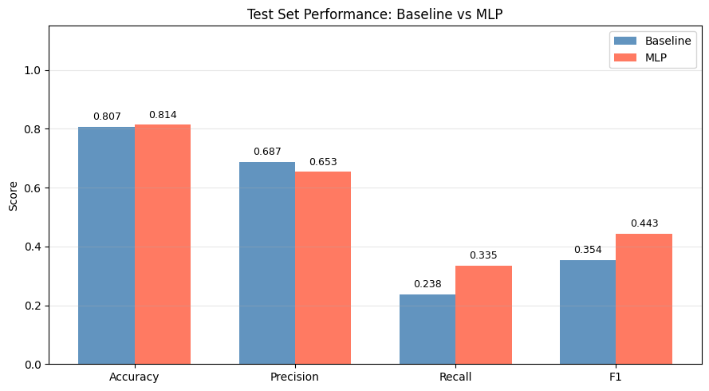
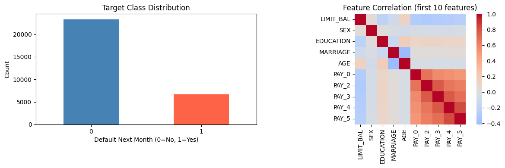

# Assignment 1 — Deep Neural Networks (DNN)
**BITS Pilani WILP | Student ID: 2025ae05144**

Comparison of a from-scratch **Logistic Regression** baseline against a from-scratch **Multi-Layer Perceptron** on a real-world binary classification dataset — implemented using NumPy only (no sklearn models, no PyTorch, no TensorFlow).

---

## Table of Contents
1. [Problem Statement](#problem-statement)
2. [Dataset](#dataset)
3. [Repository Structure](#repository-structure)
4. [Setup](#setup)
5. [Running the Notebook](#running-the-notebook)
6. [Implementation Details](#implementation-details)
   - [Baseline: Logistic Regression](#baseline-logistic-regression)
   - [MLP](#mlp)
   - [Metrics](#metrics)
7. [Results](#results)
8. [Plots](#plots)
9. [Assignment Rubric Checklist](#assignment-rubric-checklist)

---

## Problem Statement

Train and compare two models — both implemented from scratch using only NumPy — on a binary classification task:

| Model | Role |
|---|---|
| Logistic Regression | Baseline — linear decision boundary |
| MLP `[23 → 64 → 32 → 1]` | Main model — non-linear with ReLU hidden layers |

Primary metric: **F1 score** (preferred over accuracy due to class imbalance).

---

## Dataset

**Default of Credit Card Clients** — UCI ML Repository (ID = 350)

| Property | Value |
|---|---|
| Samples | 30,000 |
| Features | 23 (payment history, bill amounts, demographics) |
| Target | Binary — default next month (0 = No, 1 = Yes) |
| Positive-class rate | ~22 % (class imbalance) |
| Missing values | None |

The dataset captures credit card clients in Taiwan. Features include credit limit, demographic information (sex, education, age), repayment status for the past 6 months (`PAY_0`–`PAY_5`), bill statement amounts (`BILL_AMT1`–`BILL_AMT6`), and previous payment amounts (`PAY_AMT1`–`PAY_AMT6`).

**Download:** https://archive.ics.uci.edu/dataset/350/default+of+credit+card+clients

Save the downloaded file as `credit_card_default.csv` (or `.xls` / `.xlsx`) in the project root. The notebook falls back to auto-generated synthetic data if no file is found.

---

## Repository Structure

```
DNN/
├── 2025ae05144_assignment1.ipynb   # Main notebook (submit this)
├── 2025ae05144_assignment1.html    # HTML export (submit this)
├── credit_card_default.csv         # Dataset (download separately — not tracked)
├── requirements.txt                # Python dependencies
├── eda_plots.png                   # Class distribution + correlation heatmap
├── loss_curves.png                 # Training loss: baseline vs MLP
├── performance_comparison.png      # Bar chart: test metrics comparison
├── Assignment 1, DNN.pdf           # Original assignment brief
└── README.md                       # This file
```

---

## Setup

### 1. Create and activate a virtual environment

```bash
python3 -m venv .venv
source .venv/bin/activate        # macOS / Linux
.venv\Scripts\activate           # Windows
```

### 2. Install dependencies

```bash
pip install -r requirements.txt
```

### 3. (Optional) Download the dataset

If `ucimlrepo` can reach the UCI server it will download automatically. If you are behind a restricted network, download manually:

1. Go to https://archive.ics.uci.edu/dataset/350/default+of+credit+card+clients
2. Download the CSV or XLS file
3. Save it as `credit_card_default.csv` (or `.xls` / `.xlsx`) in the project root

> **Note:** The UCI CSV has two header rows. The notebook handles this automatically (`header=1`).

---

## Running the Notebook

```bash
source .venv/bin/activate
jupyter notebook 2025ae05144_assignment1.ipynb
```

Then: **Kernel → Restart & Run All**

Alternatively, to re-execute and re-export the HTML in one command:

```bash
.venv/bin/python _export.py
```

This runs all cells, injects outputs (including plots) into the `.ipynb`, and writes the `.html` file.

---

## Implementation Details

### Baseline: Logistic Regression

Implemented entirely from scratch in NumPy.

```
Input (23) ──► Linear ──► Sigmoid ──► Output (1)
```

| Component | Detail |
|---|---|
| Activation | Sigmoid: `σ(z) = 1 / (1 + e^{-z})` |
| Loss | Binary Cross-Entropy |
| Gradient | `dL/dw = Xᵀ(ŷ − y) / n`, `dL/db = mean(ŷ − y)` |
| Update rule | `w = w − lr × dw` |
| Hyperparams | lr = 0.1, epochs = 500 |
| Weight init | Zeros |

### MLP

Full from-scratch implementation with mandatory interface.

```
Input (23) ──► Dense(64) ──► ReLU ──► Dense(32) ──► ReLU ──► Dense(1) ──► Sigmoid ──► Output
```

| Component | Detail |
|---|---|
| Hidden activation | ReLU: `max(0, z)` |
| Output activation | Sigmoid |
| Loss | Binary Cross-Entropy |
| Weight init | He initialisation: `W ~ N(0, √(2/fan_in))` |
| Optimiser | Mini-batch gradient descent |
| Hyperparams | lr = 0.001, epochs = 500, batch_size = 256 |

**Mandatory interface (all 6 methods implemented):**

```python
class MLP:
    def __init__(self, layer_sizes)          # architecture as list
    def initialize_parameters(self)          # He init for W; zeros for b
    def forward_propagation(self, X)         # ReLU hidden, sigmoid output
    def backward_propagation(self, X, y)     # chain rule, returns grad dict
    def fit(self, X, y)                      # mini-batch training loop
    def predict(self, X)                     # returns 0/1 class labels
```

Backprop output-layer delta (sigmoid + BCE simplification):

```
dZ_L = A_L − y
dW_l = (A_{l-1}ᵀ × dZ_l) / m
db_l = mean(dZ_l, axis=0)
dA_{l-1} = dZ_l × W_lᵀ
```

### Metrics

All metrics computed from scratch (no sklearn):

```python
Accuracy  = (TP + TN) / N
Precision = TP / (TP + FP)
Recall    = TP / (TP + FN)
F1        = 2 × Precision × Recall / (Precision + Recall)
```

---

## Results

Test set performance on real UCI data:

| Metric | Baseline (LR) | MLP [64, 32] | Delta |
|---|---|---|---|
| Accuracy | 0.808 | **0.814** | +0.006 |
| Precision | **0.687** | 0.654 | −0.033 |
| Recall | 0.238 | **0.335** | **+0.097** |
| **F1** | 0.354 | **0.443** | **+0.089** |

Training time: Baseline ~0.25 s · MLP ~8.5 s

The MLP's F1 improvement (+0.089) comes primarily from a large recall gain (+0.097). The class imbalance (~22% positive) makes recall the harder metric — the MLP's hidden layers learn non-linear combinations of the repayment-status features that the linear baseline cannot capture.

---

## Plots

### Training Loss Curves


Both models decrease monotonically. The MLP converges to a lower loss, consistent with its greater representational capacity.

### Test Set Performance Comparison


F1 improvement is clearly visible. Precision trades off slightly as the MLP predicts more positives (higher recall), which is the right trade-off for a default-detection task.

### EDA


Left: target class distribution (~22% default). Right: correlation heatmap of the first 10 features.

---
